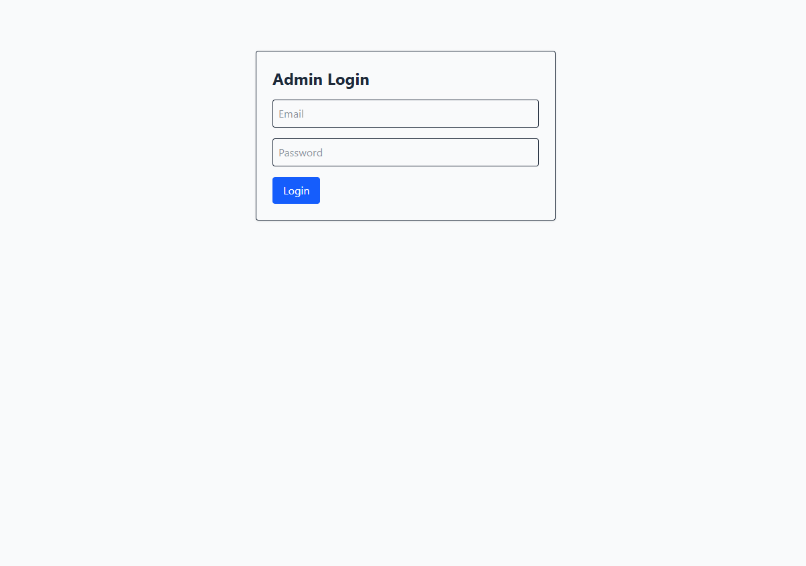
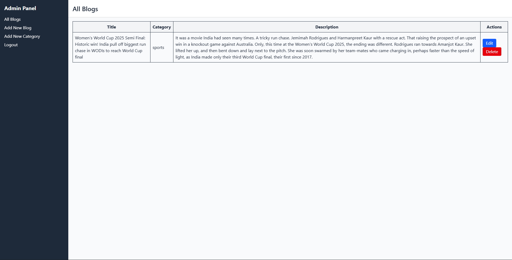
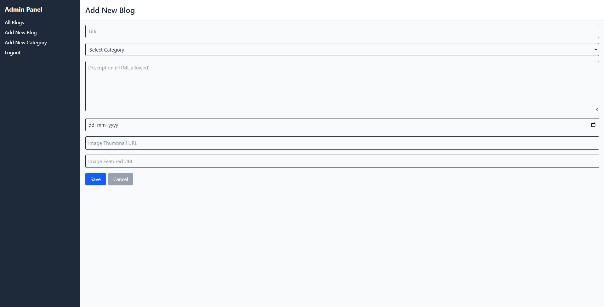
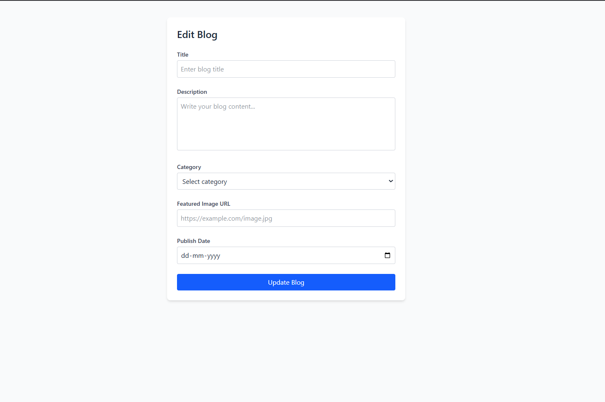
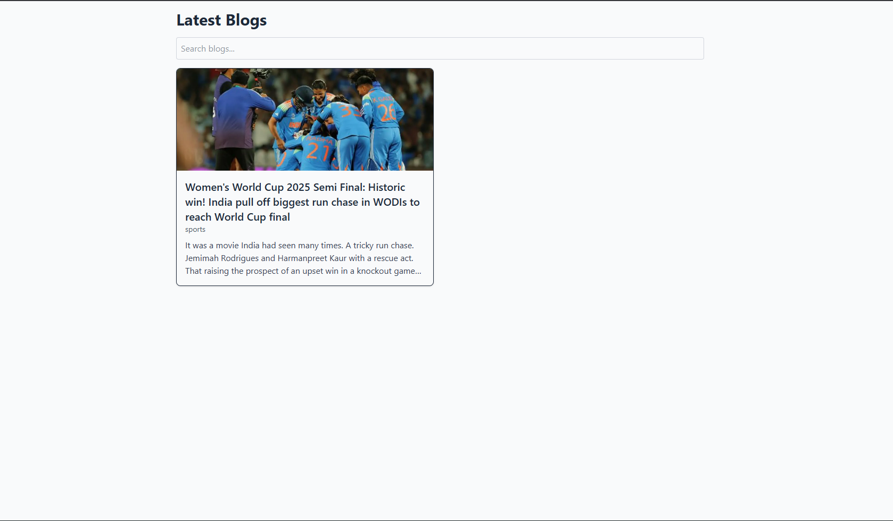
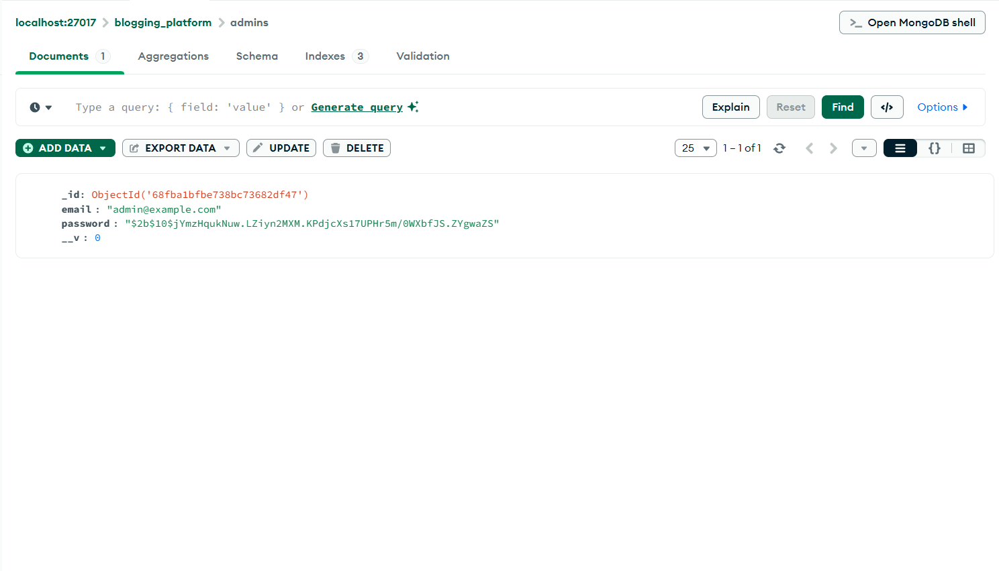
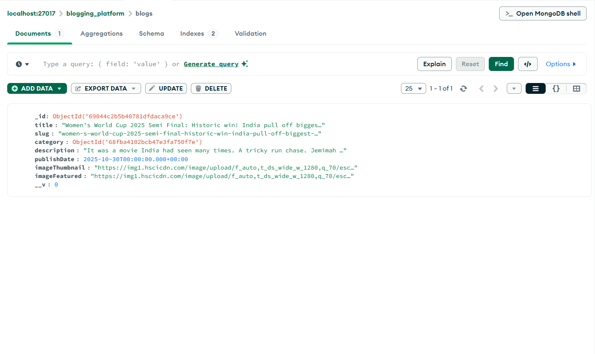
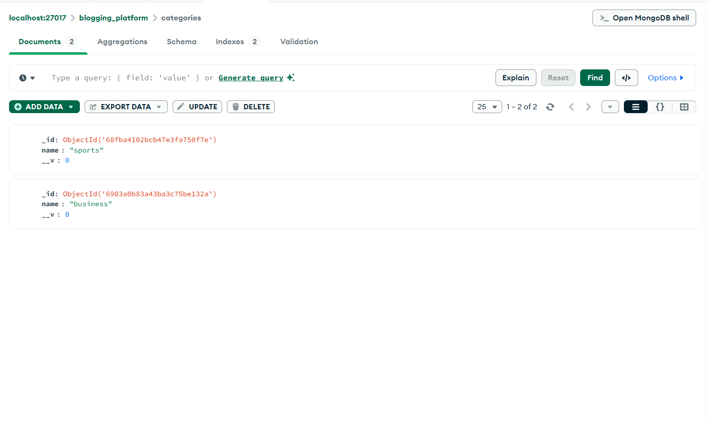

## Admin Login

## All blogs on admin dashboard

## Add New Category

## Add New Blog

## Edit Blog

## All blogs on the user screen

## Specific blog by ID

## Database for admin details

## Database for blogs details

## Database for categories details

